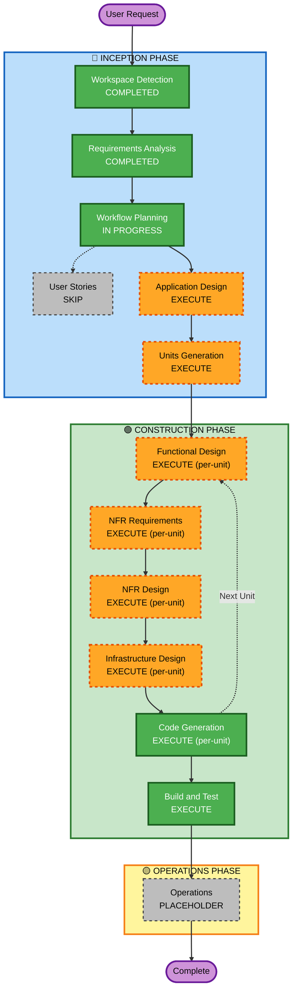

# Execution Plan — Todo App

## Detailed Analysis Summary

### Change Impact Assessment
- **User-facing changes**: Yes — full web UI with auth, todo management, file attachments
- **Structural changes**: Yes — new system from scratch (greenfield), frontend + backend + DB
- **Data model changes**: Yes — users, todos, tags, attachments, reminders, recurring tasks
- **API changes**: Yes — new REST API (Go + Fiber)
- **NFR impact**: Yes — production-grade security (15 rules), performance, testcontainers E2E

### Risk Assessment
- **Risk Level**: High — full-stack, multi-user, production-grade, security-enforced
- **Rollback Complexity**: N/A (greenfield)
- **Testing Complexity**: Complex — unit, integration, E2E (Testcontainers), partial PBT

---

## Workflow Visualization

---

## Stages to Execute

### 🔵 INCEPTION PHASE
- [x] Workspace Detection — COMPLETED
- [x] Requirements Analysis — COMPLETED
- [ ] Workflow Planning — IN PROGRESS
- [ ] Application Design — **EXECUTE**
  - *Rationale*: New system with multiple components (auth, todos, tags, attachments, reminders, recurring tasks); component methods and service layer need definition
- [ ] Units Generation — **EXECUTE**
  - *Rationale*: Complex full-stack system warrants decomposition into parallel units of work (e.g., Auth, Todo Core, Advanced Features, Frontend)

### Skipped Stages — INCEPTION PHASE
- User Stories — **SKIP**
  - *Rationale*: Single developer, no cross-functional team; requirements are clear and detailed enough to proceed without formal story artifacts

### 🟢 CONSTRUCTION PHASE (per-unit)
- [ ] Functional Design — **EXECUTE**
  - *Rationale*: New data models (users, todos, tags, attachments, recurring tasks), complex business logic (recurrence engine, reminder scheduling)
- [ ] NFR Requirements — **EXECUTE**
  - *Rationale*: Production-grade performance, security baseline (15 rules), Testcontainers E2E, partial PBT
- [ ] NFR Design — **EXECUTE**
  - *Rationale*: NFR Requirements is executing; patterns (rate limiting, structured logging, JWT validation, encryption) need design
- [ ] Infrastructure Design — **EXECUTE**
  - *Rationale*: Docker-based deployment; PostgreSQL, file storage, reverse proxy, and container orchestration need specification
- [ ] Code Generation — **EXECUTE** (ALWAYS)
- [ ] Build and Test — **EXECUTE** (ALWAYS)

### 🟡 OPERATIONS PHASE
- [ ] Operations — PLACEHOLDER

---

## Success Criteria
- **Primary Goal**: Fully functional, production-grade todo web app
- **Key Deliverables**: Go/Fiber backend, Vue 3 frontend, PostgreSQL, Docker Compose, Testcontainers backend E2E tests, Cypress frontend E2E tests
- **Quality Gates**: All SECURITY-01–15 rules compliant; backend E2E tests passing via Testcontainers; Cypress frontend tests passing; partial PBT for pure functions
